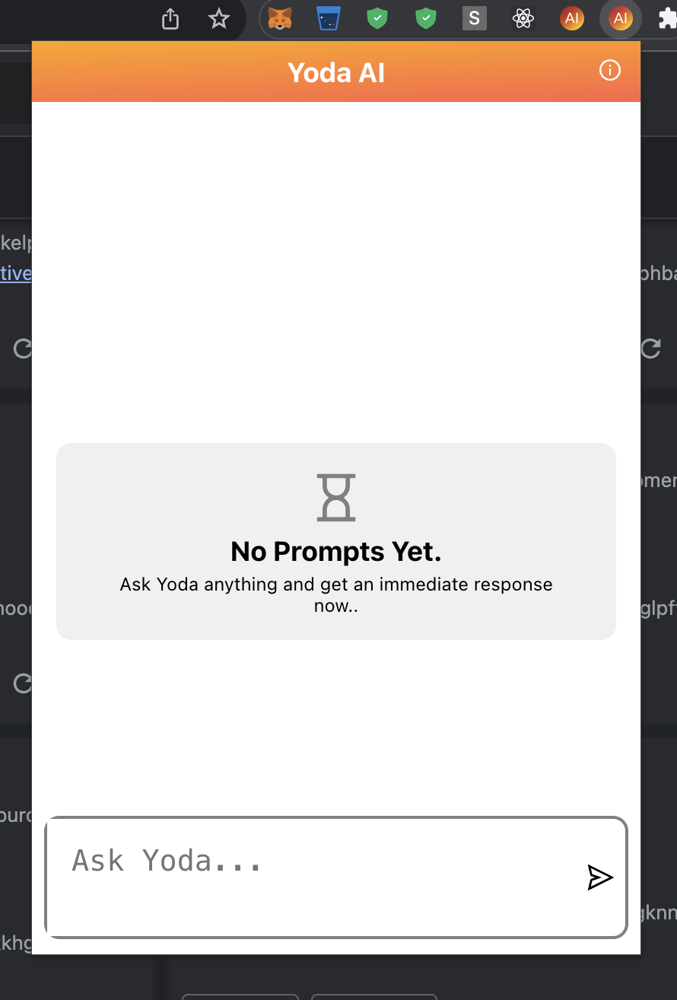

# Yoda AI: Your Wise Companion



Welcome to Yoda AI, your ultimate AI companion that runs right in your browser! Yoda is designed to be your go-to solution for a wide range of tasks, from answering questions and providing insights to offering assistance and entertainment. In this document, we'll introduce you to the exciting world of Yoda AI and guide you through getting started.


## Introduction

Yoda AI is a cutting-edge artificial intelligence designed to enhance your daily life. It combines natural language understanding, machine learning, and a vast knowledge base to assist you with a wide range of tasks. Whether you need answers to questions, want to engage in meaningful conversations, or simply seek entertainment, Yoda AI has you covered.


## Key Features

1. Conversational AI: Hold engaging conversations with Yoda AI, just like chatting with a friend.

2. Knowledge Base: Access a wealth of information, facts, and insights across various domains.

3. Personal Assistant: Set reminders, create to-do lists, and get weather updates.

4. Entertainment: Enjoy jokes, riddles, and even some wisdom from the wise Yoda himself.

5. Customization: Tailor Yoda AI to your preferences and needs.


## Tech Used

1. React: Yoda AI's browser extension is built with React. React is a leading web development framework that allows websites and browser extensions to be built with ease while utilizing the component system. Find Here https://react.dev/.

2. Chrome Extension API: Chrome Extension API is a minimal API to build browser extensions for Chrome, Firefox, Brave and Microsoft Edge browsers. Find here https://developer.chrome.com/docs/extensions/reference/.


# Running
This extension has not yet been deployed to the browser extension stores. To run this extension, you need to clone the repo to your local environment. 

```sh
git clone https://github.com/efenstakes/yoda-ai-browser-extension-v2 ext
```

Navigate to the folder.

```sh
cd ./ext
```

Install dependencies
```sh
npm i
```

Build the extension:
```sh
npm run build
```

Go to your favorite browser and load it. Enjoy.
Happy building :(.


## Extras
I build a similar API to this in TypeScript, Swift & SwiftUI, Flutter, Golang and Node.js. You can find it here in my github.


## Contact
If you wish to contact me, use my email efenstakes101@gmail.com.
